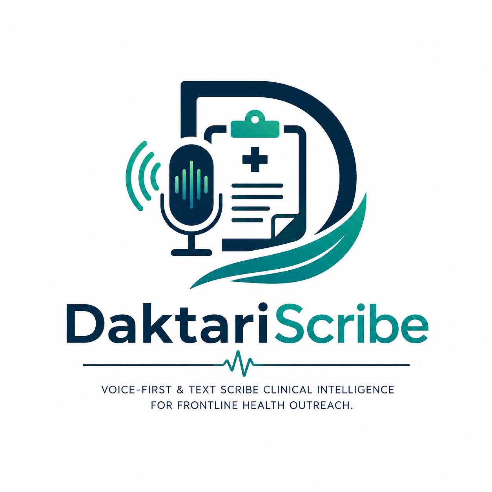
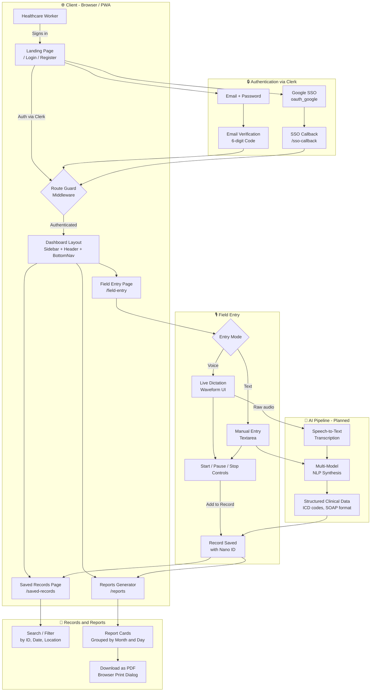
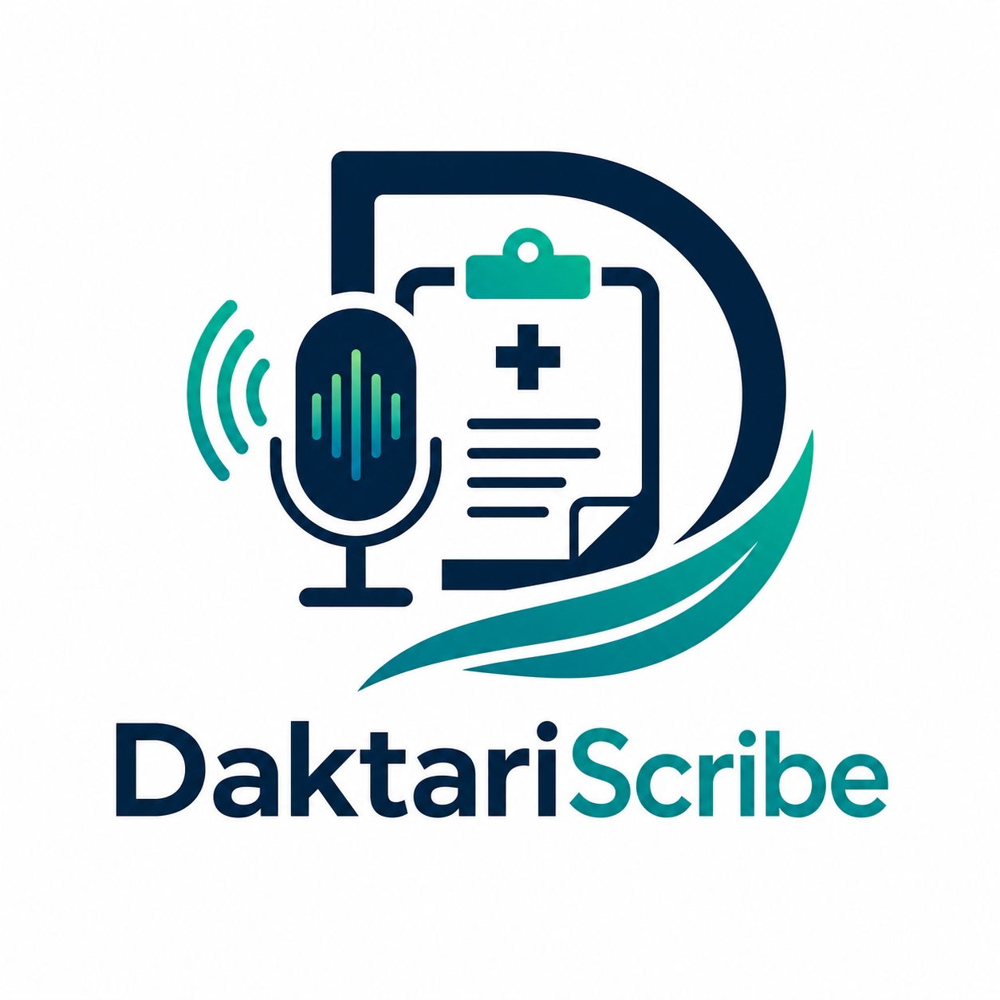

<div align="center">
  

  <br/>
  <br/>

  <p><strong>Voice-Powered &amp; Text Medical Scribe for Frontline Healthcare Workers</strong></p>

  <p>
    
    
    
    
    
  </p>

  <p>
    <em>Capture, synthesise, and report clinical encounters in the field, with minimal internet connectivity at the speed of care.</em>
  </p>
</div>

---

## 🚨 The Problem

Frontline healthcare workers operating in remote camps, mobile clinics, and humanitarian outreach settings face a **critical documentation gap**:

- 📋 **Paper-based records** are error-prone, illegible, and impossible to share in real time.
- 🌐 **Poor or no internet connectivity** makes cloud-dependent tools unusable in the field.
- ⏱️ **Documentation burden** takes time away from patient care — workers spend as much time charting as treating.
- 🗣️ **Medical jargon and voice quality** degrade transcription accuracy in noisy field environments.
- 📊 **No standardised reporting** makes aggregating clinical intelligence across camps nearly impossible.

The result: **critical clinical data is lost, delayed, or never recorded**, impacting patient outcomes and organisational health intelligence.

---

## 💡 The Proposed Solution

**DaktariScribe** is a **voice-first clinical intelligence platform** designed specifically for frontline healthcare workers. It bridges the gap between in-field care delivery and structured medical documentation:

| Capability | Description |
|---|---|
| 🎙️ **Voice Dictation** | Healthcare workers dictate clinical encounters hands-free during or after patient interactions |
| ✍️ **Manual Entry** | Alternatively type notes using a structured manual entry interface |
| 🤖 **AI Synthesis** | A multi-model AI pipeline stabilises medical jargon, resolves ambiguities, and aggregates clinical findings into structured data |
| 📁 **Modular Records** | Encounters are grouped by camp location and date, with cryptographic Nano IDs for tamper-evident record integrity |
| 📄 **PDF Report Generation** | Generate clinician-ready, print-formatted field reports downloadable directly from the browser |
| 🔒 **Encrypted & Offline-Ready** | Data is encrypted at rest with offline-first architecture enabling operation in low-connectivity environments |

---

## 🏗️ Tech Stack

<div align="center">

| Layer | Technology | Purpose |
|---|---|---|
| **Framework** | [Next.js 16](https://nextjs.org/) (App Router) | Full-stack React framework with SSR & API routes |
| **UI Library** | [React 19](https://react.dev/) | Component-based, server & client rendering |
| **Language** | [TypeScript 5](https://www.typescriptlang.org/) | Type-safe development across the stack |
| **Styling** | [Tailwind CSS v4](https://tailwindcss.com/) | Utility-first design system with custom design tokens |
| **Authentication** | [Clerk](https://clerk.com/) | Drop-in auth: email/password, Google SSO, email verification |
| **Icons** | [Google Material Symbols](https://fonts.google.com/icons) | Outlined icon set loaded via Google Fonts CDN |
| **Typography** | [Inter (Google Fonts)](https://fonts.google.com/specimen/Inter) | Modern, legible sans-serif for medical UIs |
| **Image Optimisation** | Next.js Image (AVIF/WebP) | Automatic format conversion and lazy loading |
| **PostCSS** | PostCSS + postcss-preset-env | CSS transformation and cross-browser compatibility |

</div>

---

## ⚙️ System Architecture

> How DaktariScribe works — from field capture to structured report.



---

## 📁 Project Structure

```
DaktariScribe/
├── app/
│   ├── (dashboard)/              # Protected route group
│   │   ├── field-entry/          # Voice & manual dictation workspace
│   │   ├── saved-records/        # Historical records browser with filters
│   │   ├── reports/              # PDF report generator
│   │   └── layout.tsx            # Dashboard shell (Sidebar + Header + BottomNav)
│   ├── register/                 # Account creation with email verification
│   ├── forgot-password/          # Password reset flow
│   ├── sso-callback/             # Google OAuth callback handler
│   ├── legal/                    # Terms of Service & Privacy Policy
│   ├── layout.tsx                # Root layout (ClerkProvider, Inter font, globals)
│   └── page.tsx                  # Landing page (HeroSection + LoginSection)
├── components/
│   ├── landing/
│   │   ├── HeroSection.tsx       # Animated hero with features bento grid
│   │   ├── LoginSection.tsx      # Sign-in form (email + Google SSO)
│   │   ├── FeatureCard.tsx       # Feature bento card with glassmorphism
│   │   └── LandingFooter.tsx     # Footer with legal links
│   ├── layout/
│   │   ├── Sidebar.tsx           # Desktop navigation sidebar
│   │   ├── Header.tsx            # Top app bar
│   │   └── BottomNav.tsx         # Mobile bottom navigation
│   └── reports/
│       └── ReportCard.tsx        # Individual report card with download action
├── public/
│   └── assets/
│       ├── DaktariScribe-Full-Logo.png
│       ├── DaktariScribe-Logo-Tagline.png
│       ├── DaktariScribe-Favicon.png
│       └── Hero-section.jpg
├── middleware.ts                  # Clerk route protection
├── next.config.ts                 # Next.js config (AVIF/WebP image formats)
├── theme.css                      # Custom design tokens & CSS variables
└── package.json
```

---

## 🚀 Getting Started

### Prerequisites

Make sure you have the following installed:

- **Node.js** `>= 18.x` — [Download](https://nodejs.org/)
- **npm** `>= 9.x` (bundled with Node.js)
- A **Clerk** account and application — [clerk.com](https://clerk.com/)

### 1. Clone the Repository

```bash
git clone https://github.com/your-org/DaktariScribe.git
cd DaktariScribe
```

### 2. Install Dependencies

```bash
npm install
```

### 3. Configure Environment Variables

Create a `.env.local` file in the root of the project:

```env
# Clerk Authentication — get these from your Clerk Dashboard
NEXT_PUBLIC_CLERK_PUBLISHABLE_KEY=pk_test_xxxxxxxxxxxxxxxxxxxxxxxxxxxx
CLERK_SECRET_KEY=sk_test_xxxxxxxxxxxxxxxxxxxxxxxxxxxx

# Clerk Redirect URLs
NEXT_PUBLIC_CLERK_SIGN_IN_URL=/
NEXT_PUBLIC_CLERK_SIGN_UP_URL=/register
NEXT_PUBLIC_CLERK_AFTER_SIGN_IN_URL=/field-entry
NEXT_PUBLIC_CLERK_AFTER_SIGN_UP_URL=/field-entry
```

> **How to get your Clerk keys:**
> 1. Sign up at [clerk.com](https://clerk.com/)
> 2. Create a new application
> 3. Enable **Email/Password** and **Google OAuth** sign-in methods
> 4. Copy your Publishable Key and Secret Key from the **API Keys** section

### 4. Run the Development Server

```bash
npm run dev
```

Open [http://localhost:3000](http://localhost:3000) in your browser to view the application.

### 5. Build for Production

```bash
npm run build
npm start
```

---

## 🔑 Key Features Walkthrough

### 🏠 Landing & Authentication
- Split-screen landing page: animated hero on the left, sign-in card on the right
- **Google SSO** one-click login via Clerk OAuth
- **Email/Password** login with show/hide password toggle
- **Registration** with two-step email verification (6-digit OTP)
- **Forgot Password** recovery flow
- Route-level protection via `middleware.ts` — unauthenticated users are redirected to login

### 🎙️ Field Entry (`/field-entry`)
- Toggle between **Dictation** mode and **Manual Entry** mode
- Animated waveform visualiser during live recording
- Recording controls: **Start**, **Pause**, **Stop**
- **Add to Record** saves the encounter with a cryptographic Nano ID (`DS-YYYY-DD-MM-NANO-XXXX`)

### 📁 Saved Records (`/saved-records`)
- Tabular view of all historical encounter records
- **Search** by Record ID, filter by **Date Range** and **Outreach Location**
- Paginated results with page navigation controls

### 📊 Reports Generator (`/reports`)
- Encounter records rendered as printable **Field Report Cards**
- Records grouped chronologically by **Month/Year** and **Day**
- Each card shows: Record ID, Date/Time, Location, Healthcare Worker, Clinical Recording transcript
- **Download as PDF** triggers the browser print dialog for instant offline-ready reports

---

## 🛡️ Security & Compliance

- **Authentication** — All dashboard routes are protected via Clerk middleware; unauthenticated access is blocked server-side
- **Encrypted Sessions** — Clerk handles session tokens using industry-standard JWT + RS256 signing
- **Nano ID Record Integrity** — Each clinical record gets a cryptographically random ID to prevent tampering or enumeration
- **Confidentiality Notice** — All generated reports carry a legal notice: *"Information contained herein is strictly confidential and intended for authorized medical personnel only."*
- **Terms & Privacy** — Users must agree to Terms of Service and Privacy Policy during registration

---

## 🤝 Contributing

1. Fork the repository
2. Create a feature branch: `git checkout -b feature/your-feature-name`
3. Commit your changes: `git commit -m 'feat: add your feature'`
4. Push to the branch: `git push origin feature/your-feature-name`
5. Open a Pull Request

---

## 📄 License

© 2026 DaktariScribe Clinical Network. All rights reserved.

---

<div align="center">
  
  <br/>
  <sub>Built with ❤️ for frontline healthcare workers everywhere.</sub>
</div>
